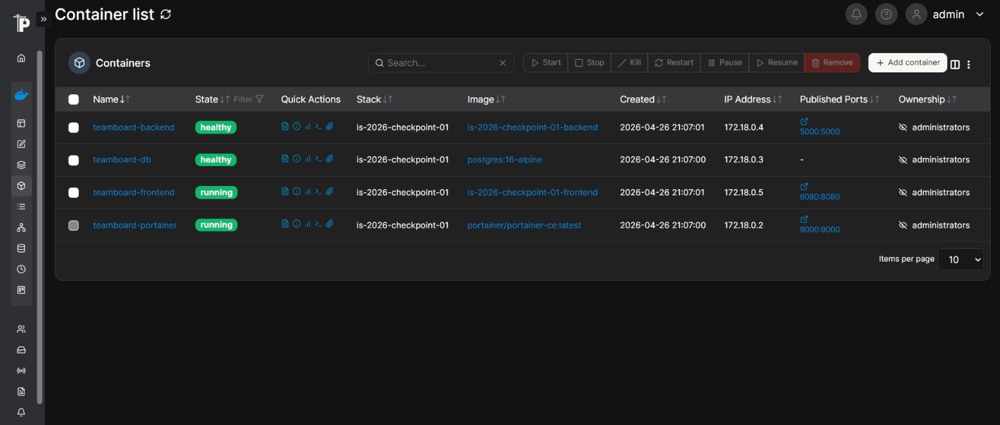
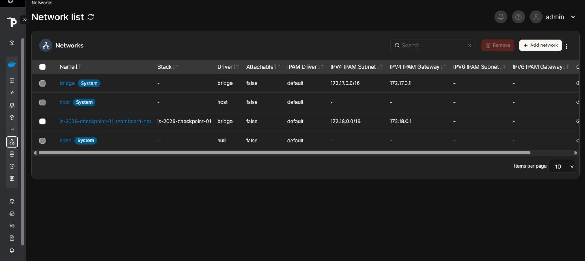
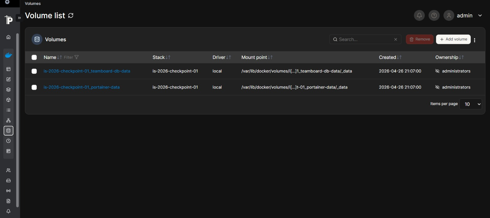
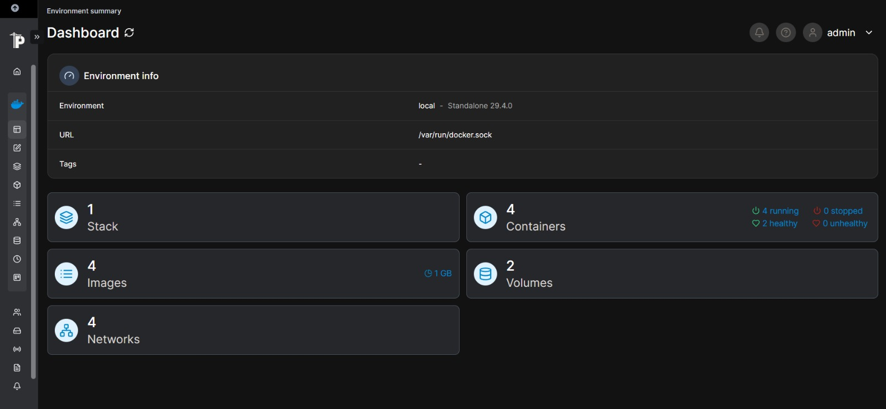

# TeamBoard App - Checkpoint 01

Aplicación web desarrollada como parte del Checkpoint 01 de Ingeniería y Calidad de Software. 
Se trata de un proyecto con una arquitectura basada en microservicios utilizando **Docker** y **Docker Compose**.

## Arquitectura del Proyecto

El sistema está compuesto por los siguientes servicios:
- **Frontend**: Aplicación web estática (HTML, CSS, JS) servida con un servidor HTTP minimalista de Python.
- **Backend**: API REST desarrollada en Python con Flask.
- **Base de Datos**: PostgreSQL para almacenamiento persistente de los datos de los integrantes.
- **Portainer**: Panel web de administración y monitoreo de contenedores Docker.

## Despliegue del Proyecto

Para ejecutar la aplicación en un entorno local, se deben seguir los siguientes pasos:

1. **Clonar el repositorio**:
   ```bash
   git clone <URL_DEL_REPOSITORIO>
   cd TP1
   ```

2. **Configurar las variables de entorno**:
   Copiar el archivo `.env.example` y renombrarlo a `.env`. Modificar los valores según sea necesario.
   ```bash
   cp .env.example .env
   ```

3. **Levantar los contenedores**:
   Utilizar Docker Compose para construir e inicializar todos los servicios:
   ```bash
   docker compose up -d --build
   ```

4. **Acceso a los servicios**:
   - **Frontend**: `http://localhost:8080`
   - **Backend (API)**: `http://localhost:5000`
   - **Portainer**: `http://localhost:9000`

---

## Equipo y Contribuciones

A continuación se detalla la tabla de integrantes y las tareas (features) desarrolladas por cada uno de ellos para este proyecto:

| Legajo | Nombre y Apellido | Rol / Servicio | Feature |
|--------|-------------------|----------------|---------|
| 32042  | Mauro Lista       | Coordinador    | Feature 01 |
| 33168  | Juan Cruz Caceres | Frontend       | Feature 02 |
| 32307  | Thiago Perez      | Backend        | Feature 03 |
| 32671  | Oriana Acosta     | PostgreSQL     | Feature 04 |
| 33433  | Iara Rearte       | Portainer      | Feature 05 |

### Detalles de Implementación por Feature

#### Feature 01 - Coordinación, Infraestructura Base y README
* **Responsable:** Mauro Lista
* **Descripción:** Creación del repositorio, configuración de protección de ramas, creación de estructura base de carpetas y `.gitignore`. Su entregable técnico principal es el `docker-compose.yml` que orquesta los cuatro servicios, junto con la definición de variables de entorno `.env` y `.env.example`. Es responsable de integrar el trabajo del equipo, resolver conflictos de merge y verificar que `docker compose up` funcione correctamente.
* **Tecnología:** Docker Compose, Git, GitHub.

#### Feature 02 - Frontend — Página Web con HTML y JavaScript
* **Responsable:** Juan Cruz Caceres
* **Descripción:** Interfaz de usuario servida mediante un servidor HTTP minimalista de Python (`python3 -m http.server 8080`). El archivo `app.js` consume la API del backend mediante `fetch()` (`/api/team`) y renderiza dinámicamente la tabla de integrantes y un indicador de estado del servicio.
* **Tecnología:** Docker, Python 3.12-slim, HTML, CSS, JavaScript.

#### Feature 03 - Backend — API REST con Python y Flask
* **Responsable:** Thiago Perez
* **Descripción:** Capa intermedia que conecta el frontend con la base de datos PostgreSQL. Expone la API REST que devuelve información sobre los integrantes desde la base de datos. Endpoints principales: `/api/health` (estado del servicio), `/api/team` (lista de integrantes), `/api/info` (metadata).
* **Tecnología:** Docker, Python 3.12-slim, Flask, psycopg2, Gunicorn.

#### Feature 04 - Base de Datos con PostgreSQL
* **Responsable:** Oriana Acosta
* **Descripción:** Almacenamiento persistente de los datos del equipo mediante la imagen oficial de PostgreSQL (`postgres:16-alpine`). Incluye la configuración en el Compose para montar un volumen y persistir la información. Proveé un script `init.sql` que crea automáticamente la tabla `members` y la pobla con los datos iniciales de los integrantes al levantar el contenedor por primera vez.
* **Tecnología:** Docker, PostgreSQL 16-alpine, variables de entorno.

#### Feature 05 - Panel de Monitoreo con Portainer
* **Responsable:** Iara Rearte
* **Descripción:** Utilizamos Portainer CE como panel web de monitoreo y administración de contenedores docker del proyecto. Esta herramienta permite gestionar la infraestructura desde una interfaz gráfica, sin depender exclusivamente de la terminal.
  
**Configuración:**
- El servicio fue configurado en el `docker-compose.yml` utilizando la imagen `portainer/portainer-ce:latest`.
- Se montó el socket docker (`/var/run/docker.sock`) para conectarse al motor docker del host.
- Se configuró un volumen persistente (`portainer-data`) para conservar usuarios y configuraciones.

**Acceso:**
- Disponible en `http://localhost:9000`. 
- En el primer acceso solicita crear un usuario administrador.

**Verificaciones realizadas:**

Visualización de contenedores del sistema.


Visualización de redes Docker.


Visualización de volúmenes persistentes.


Administración desde interfaz web.

